# Stress Concentration Factor Analysis of Perforated Steel Plate
### Finite Element Analysis using ABAQUS | A36 Structural Steel | Plane-Stress

---

## Project Overview

This project presents a comprehensive **Finite Element Analysis (FEA)** of a perforated A36 structural steel plate to evaluate the **Stress Concentration Factor (SCF)** as a function of the **hole diameter-to-plate width ratio (d/D)**. The study was conducted using **ABAQUS 6.14-5** under uniaxial tensile loading, with a systematic comparison of element types and mesh refinement strategies.

Stress concentrations at geometric discontinuities (holes, notches) are a leading cause of fatigue failure in structural components. This project quantifies these effects numerically, providing insight applicable to **shipbuilding, marine, and mechanical engineering** design.

<p align="center">
  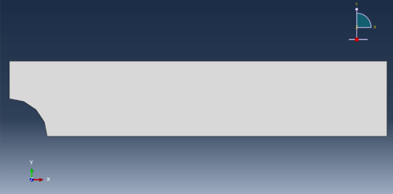
  <br>
  <em>Figure: Perforated steel plate under uniaxial tensile loading with central circular hole</em>
</p>

---

## Objectives

- Numerically evaluate the **Stress Concentration Factor (SCF / Kt)** for varying d/D ratios
- Investigate the influence of **hole geometry** on stress amplification
- Compare performance of **four element types**: T3 (CST), T6 (LST), Q4, and Q8
- Conduct **mesh sensitivity analysis** (h-convergence and p-convergence)
- Validate results against **classical elasticity theory**

---

## Problem Definition

### Plate Geometry

| Parameter | Value |
|-----------|-------|
| Length (L) | 300 mm |
| Width (D) | 60 mm |
| Thickness (t) | 6 mm |
| Model Type | Quarter-symmetric, Plane-stress |

### Hole Configurations

| Case | Hole Diameter (d) | d/D Ratio | Hole Radius (r) |
|------|-------------------|-----------|-----------------|
| 1 | 6 mm | 0.10 | 3 mm |
| 2 | 18 mm | 0.30 | 9 mm |
| 3 | 30 mm | 0.50 | 15 mm |

### Material Properties — A36 Structural Steel

| Property | Value |
|----------|-------|
| Modulus of Elasticity (E) | 210 × 10³ MPa |
| Poisson's Ratio (ν) | 0.30 |
| Density (ρ) | 7.85 × 10⁻⁹ kg/mm³ |
| Behavior | Linear Elastic, Isotropic |

### Loading Conditions

| Load Level | Applied Load (kN) | Nominal Stress (MPa) |
|------------|-------------------|----------------------|
| 30% Yield | 13.4 kN | 37.22 MPa |
| 60% Yield | 26.8 kN | 74.44 MPa |
| 90% Yield | 40.2 kN | 111.67 MPa |

> Yield load determined experimentally: **44.67 kN**

---

## Methodology

### Modeling Workflow in ABAQUS

```
Start → Part Creation → Material Definition → Section Assignment
      → Step Definition → Loads & BCs → Mesh Generation
      → Job Submission → Post-Processing → SCF Extraction
```
### Key Modeling Decisions

- **Quarter-symmetry model** used to reduce computational cost while preserving accuracy
- **Plane-stress assumption** applied (thickness << in-plane dimensions)
- Modeled domain: **150 mm × 30 mm** with quarter-circular hole
- Boundary conditions:
  - Left edge: `U1 = 0` (symmetry)
  - Bottom edge: `U2 = 0` (symmetry)
  - Right edge: Uniform tensile pressure load

<p align="center">
  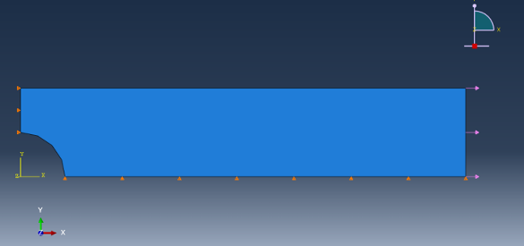
  <br>
  <em>Figure: Quarter-symmetric model with applied loads and boundary conditions</em>
</p>

### Nominal Stress Calculation

$$\sigma_{nom} = \frac{F}{A_{net}} = \frac{F}{(w - d) \times t}$$

### SCF Definition

$$K_t = \frac{\sigma_{max}}{\sigma_{nom}}$$

where `σ_max` is extracted from ABAQUS at the hole edge (S11 component).

---

## 🕸️ Mesh Strategy

Two mesh densities were evaluated for mesh sensitivity:

| Mesh Type | Global Max Size | Global Min Size | Local (Hole Edge) |
|-----------|----------------|----------------|-------------------|
| Coarse | 5 mm | 3 mm | 3 mm |
| Fine | 2 mm | 0.5 mm | 0.5 mm |

All final results use the **fine mesh** configuration. Local edge seeding was applied at the hole boundary to capture steep stress gradients.

<p align="center">
  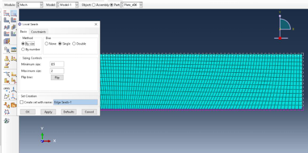
  <br>
  <em>Figure: Fine mesh with local refinement at hole boundary</em>
</p>

### Element Types Compared

| Element | Type | Nodes | Strain Field |
|---------|------|-------|--------------|
| **T3** | Linear Triangular (CST) | 3 | Constant |
| **T6** | Quadratic Triangular (LST) | 6 | Linear |
| **Q4** | Linear Quadrilateral | 4 | Linear |
| **Q8** | Quadratic Quadrilateral | 8 | Quadratic |

---

## Results

### von Mises Stress Contours

Stress concentration is clearly visible at the hole boundary for all configurations, with the far-field stress remaining nearly uniform.

#### d = 6 mm (d/D = 0.10) — Load: 40.2 kN

<p align="center">
  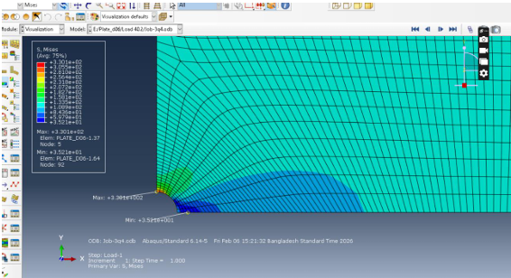
  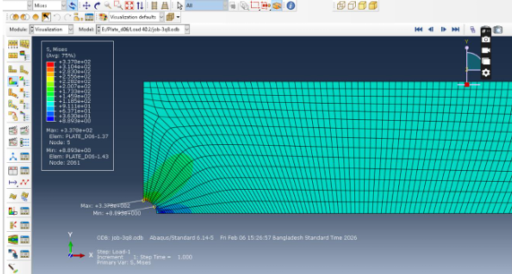
  <br>
  <em>Left: Q4 Element &nbsp;&nbsp;|&nbsp;&nbsp; Right: Q8 Element</em>
</p>

<p align="center">
  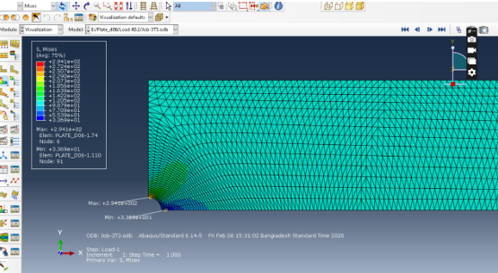
  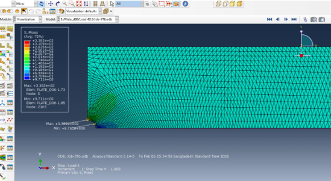
  <br>
  <em>Left: T3 Element &nbsp;&nbsp;|&nbsp;&nbsp; Right: T6 Element</em>
</p>

#### d = 18 mm (d/D = 0.30) — Load: 40.2 kN

<p align="center">
  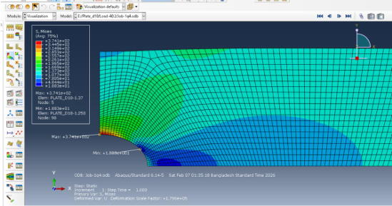
  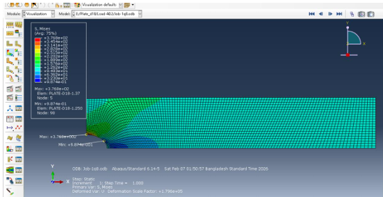
  <br>
  <em>Left: Q4 Element &nbsp;&nbsp;|&nbsp;&nbsp; Right: Q8 Element</em>
</p>

#### d = 30 mm (d/D = 0.50) — Load: 40.2 kN

<p align="center">
  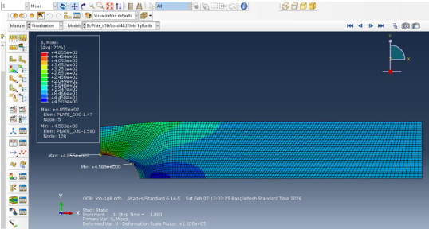
  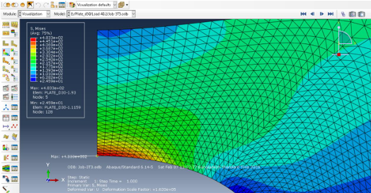
  <br>
  <em>Left: Q8 Element &nbsp;&nbsp;|&nbsp;&nbsp; Right: T3 Element</em>
</p>

---

### S11 Normal Stress Contours

S11 (axial stress in loading direction) is used as the primary basis for SCF evaluation.

<p align="center">
  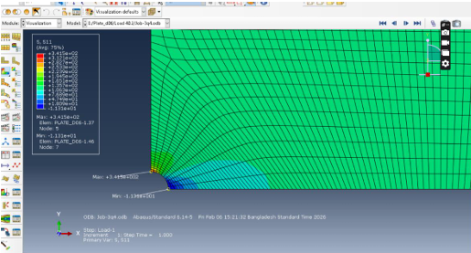
  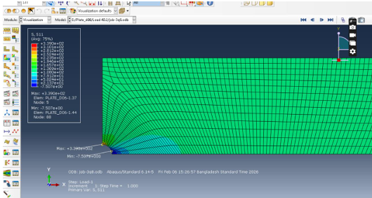
  <br>
  <em>S11 contours for d = 6 mm — Q4 (left) and Q8 (right)</em>
</p>

---

### Maximum Stress Summary Tables

#### d = 6 mm — Maximum S11 Stress (MPa)

| Load (kN) | T3 | T6 | Q4 | Q8 |
|-----------|----|----|----|----|
| 13.4 | 100.1 | 113.0 | 113.8 | 114.6 |
| 26.8 | 226.0 | 225.8 | 227.6 | 226.9 |
| 40.2 | 340.0 | 339.5 | 379.9 | 378.6 |

#### d = 18 mm — Maximum S11 Stress (MPa)

| Load (kN) | T3 | T6 | Q4 | Q8 |
|-----------|----|----|----|----|
| 13.4 | 126.2 | 125.7 | 126.6 | 125.7 |
| 26.8 | 252.4 | 251.4 | 253.3 | 251.4 |
| 40.2 | 378.6 | 377.1 | 379.9 | 377.1 |

#### d = 30 mm — Maximum S11 Stress (MPa)

| Load (kN) | T3 | T6 | Q4 | Q8 |
|-----------|----|----|----|----|
| 13.4 | 161.2 | 161.9 | 162.5 | 161.9 |
| 26.8 | 322.5 | 323.7 | 325.0 | 323.7 |
| 40.2 | 483.7 | 485.6 | 487.5 | 485.6 |

---

### Stress Concentration Factor (Kt) Results

SCF was computed using net-section nominal stress: `σ_nom = F / ((w − d) × t)`

#### Summary — Kt based on S11 (Q4 Element)

| d/D | Load 13.4 kN | Load 26.8 kN | Load 40.2 kN |
|-----|-------------|-------------|-------------|
| 0.10 (d=6mm) | 2.75 | 2.75 | 2.75 |
| 0.30 (d=18mm) | 2.38 | 2.38 | 2.38 |
| 0.50 (d=30mm) | 2.18 | 2.18 | 2.18 |

> Kt is **independent of load magnitude** under linear elastic conditions confirming numerical consistency.


### Element Type Comparison

| Element | Accuracy | Notes |
|---------|----------|-------|
| **T3** | ⭐⭐ | Underestimates peak stress — constant strain, overly stiff |
| **Q4** | ⭐⭐⭐ | Good accuracy with mesh refinement |
| **T6** | ⭐⭐⭐⭐ | Better than T3, smooth stress capture |
| **Q8** | ⭐⭐⭐⭐⭐ | Most accurate — smoothest contours, highest consistency |

---

## Key Findings

### Effect of d/D Ratio on SCF

| d/D | Kt (Q4, S11-based) | Trend |
|-----|-------------------|-------|
| 0.10 | ~2.75 | Higher SCF |
| 0.30 | ~2.38 | Moderate |
| 0.50 | ~2.18 | Lower SCF |

> **SCF decreases as d/D increases.** Although larger holes produce higher absolute stresses at the boundary, the nominal stress grows faster due to reduced net cross-section resulting in a lower Kt. This is consistent with classical elasticity theory.

### Mesh Sensitivity

- **h-convergence**: Refining element size near the hole edge improves stress resolution and stabilizes peak values
- **p-convergence**: Higher-order elements (T6, Q8) capture steep gradients without requiring excessive mesh density
- Fine mesh (max 2mm, min 0.5mm at hole) was sufficient to achieve mesh-independent results

---

## Tools & Software

| Tool | Purpose |
|------|---------|
| **ABAQUS 6.14-5** | FEA solver and pre/post-processing |
| **ABAQUS/Standard** | Static linear elastic solver |
| **Visualization Module** | Stress contour extraction (S11, von Mises) |

---

## Theoretical Background

For a plate with a central circular hole under uniaxial tension, classical elasticity (Kirsch, 1898) gives a theoretical SCF of **Kt = 3.0** for an infinitely wide plate. As the d/D ratio increases (finite-width plate), this value deviates due to the reduced ligament area. The Peterson stress concentration charts provide empirical corrections for finite widths, against which FEA results can be validated.

---

## Author

**Md Rabiul Hasan**  
Department of Building Engineering & Construction Management  
Rajshahi University of Engineering & Technology<br>
Mail: rabiul1812019@gmail.com
